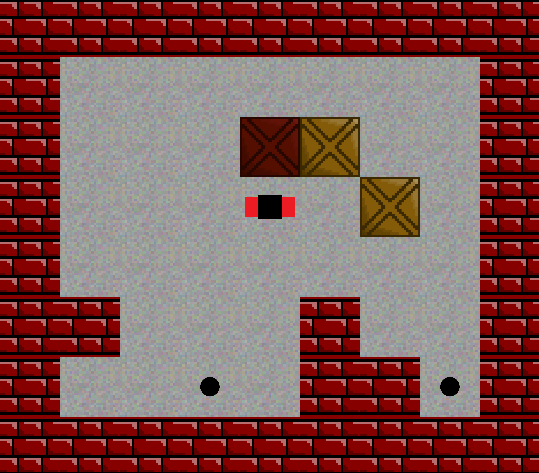
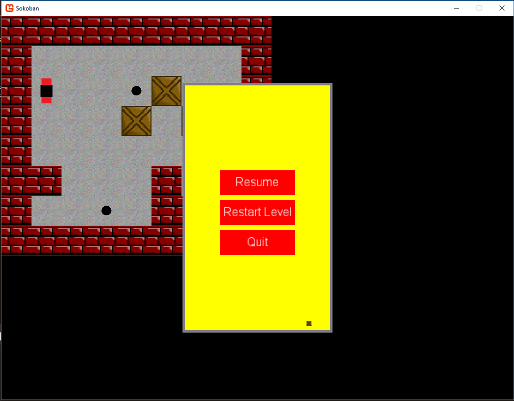
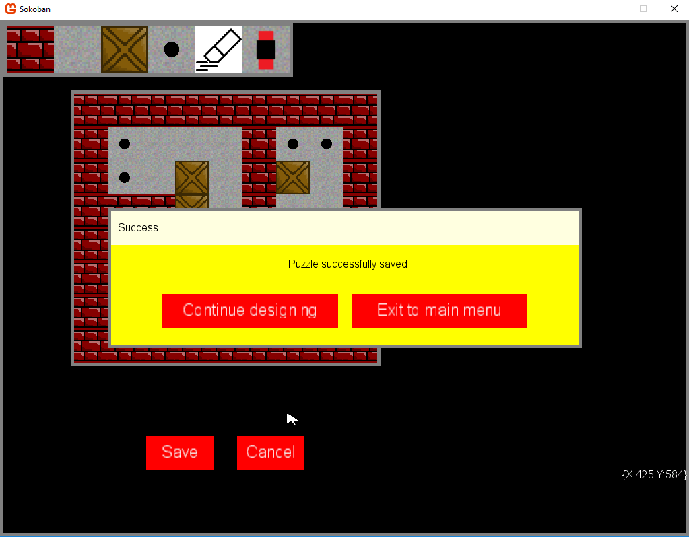
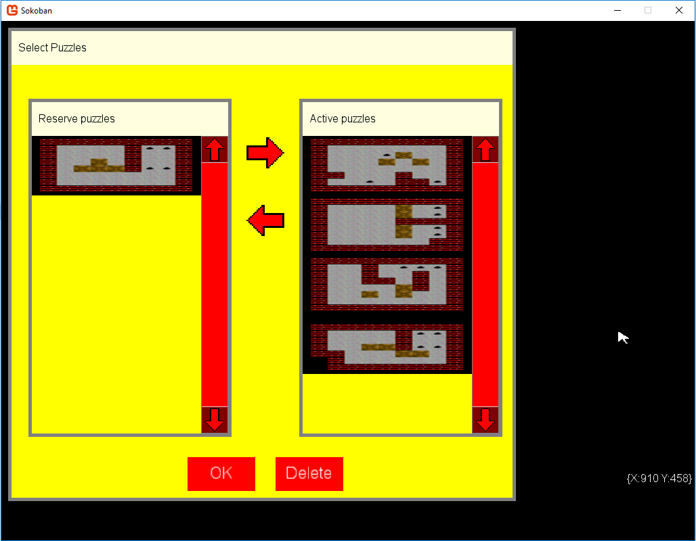

#Sokoban

A Sokoban clone, written in C#. The object of the game is to push all boxes onto the dots. This version that I wrote can take customized maps (puzzles) to play on. The user may design puzzles him/herself, after which they go into the "reserved" pool of puzzles. Only the "active" pool of puzzles are played. The reserved and active pools may be modified via the puzzle selector (from the main menu) shown in the fourth screenshot below. 

Note that the puzzle designer checks basic validity of the puzzle, such as whether it has a starting position, whether the walls enclose the puzzle and whether all areas are reachable. The last aforementioned requirement was checked by implementing a relatively simple depth-first search algorithm: all connected paths in the puzzle are visited, after which it is easy to determine whether all paths are reachable. I have done some basic testing of the algorithm, and of the validation of the designed puzzles, but I hope to test it a bit more thoroughly soon.

A custom API was written to facilitate the creation of a GUI for the game. This included creating my own code for buttons, forms, scrollbars, etc. This was done using the raw graphics functionality provided by the XNA framework (through Monogame). I hope to extend and generalize this API so that it can be used by other programmers too.

Note that this is a work in progress, and is still a little rough around the edges. However, basic functionality is there (check TODO list, after the screenshots below, for information on bugs, missing features, etc.)

The project is very easy to compile: all you need is visual studio, with support for C#. Open the sln file in the root directory, and compile. However, you will most likely need Monogame installed for visual studio. Note that I have included a compiled version in the zip file in the root (SokobanCompiled.zip). There was, however, some difficulty when I tried to run this executable on another computer - most likely because .NET framework 4.0 was not installed on that PC.

##TODO

+ In puzzle editor,
 - add functionality for specifying the grid size
 - enable existing puzzles to be imported and modified
 
+ Enable scroller to be moved by dragging it (not only by pressing arrow keys, e.g. in lists in puzzle selector)

+ Find new color scheme/better artwork (not this ugly yellow)

+ Do more thorough testing of puzzle validation

+ Cleanup code (make naming more consistent, relocate certain functions/methods to more sensible locations, etc.)

##Screenshots

