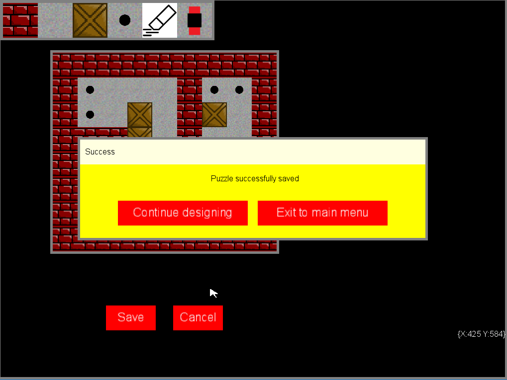

#Sokoban

A Sokoban clone. The user must push all boxes onto the dots. This version that I wrote can take customized maps (puzzles) to play on. The user may design puzzles him/herself, after which they go into the "reserved" pool of puzzles. Only the "active" pool of puzzles are played. The reserved and active pools may be modified via the puzzle selector (from the main menu) shown in the fourth screenshot below.

A custom API was written to facilitate the creation of a GUI for the game. This included creating classes for buttons, forms, etc. This was done using the graphics functionality provided by the XNA framework (through Monogame).

Note that this is a work in progress, and is still a little rough around the edges. However, basic functionality is there (check TODO list, after the screenshots below, for information on bugs, missing features, etc.)

##TODO

+ In puzzle editor,
 - add functionality for specifying the grid size
 - prevent image of standard mouse cursor to be painted on grid

+ Add functionality for deletion of puzzles

+ Add functionality for active puzzles to stay active even after game was exited

+ Find new color scheme (this ugly yellow won't do!)

+ Cleanup code (make naming more consistent, relocate certain functions/methods to more sensible locations, etc.)
